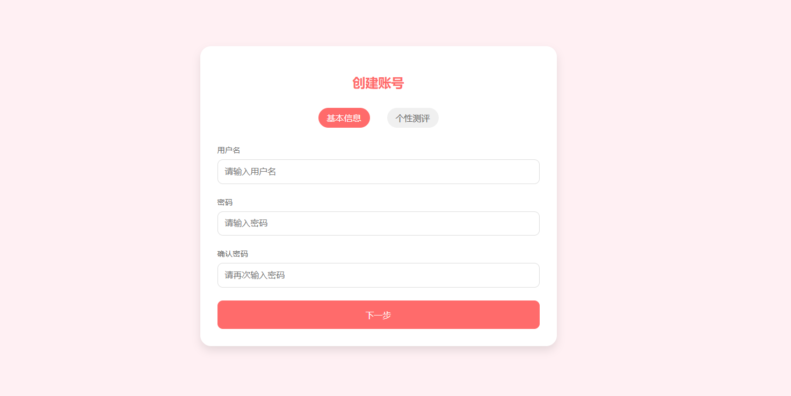
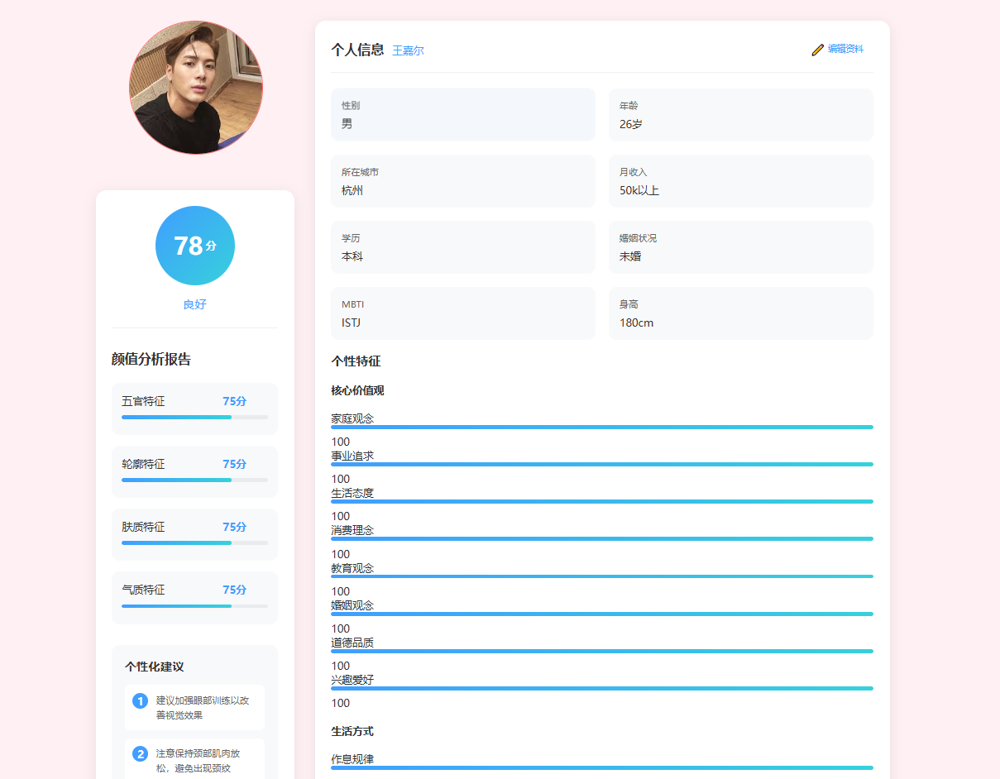
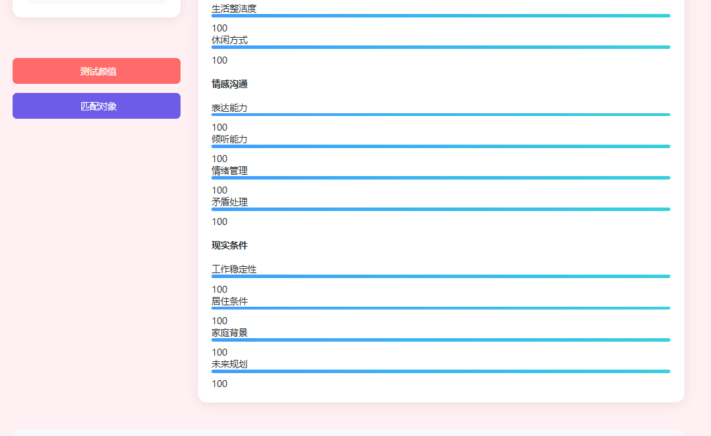
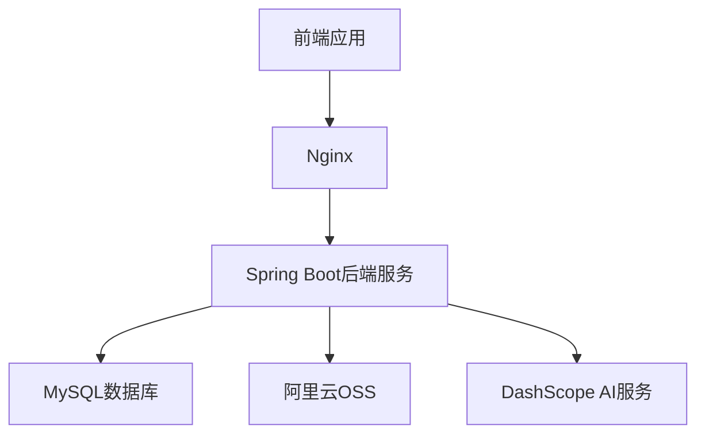
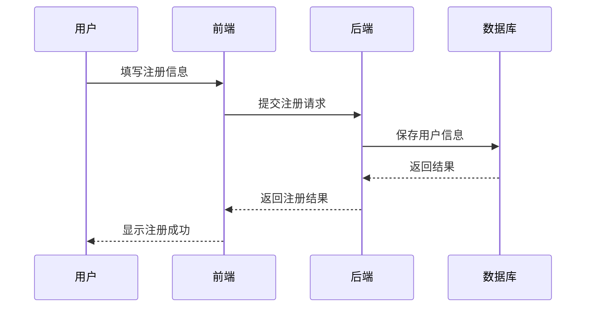
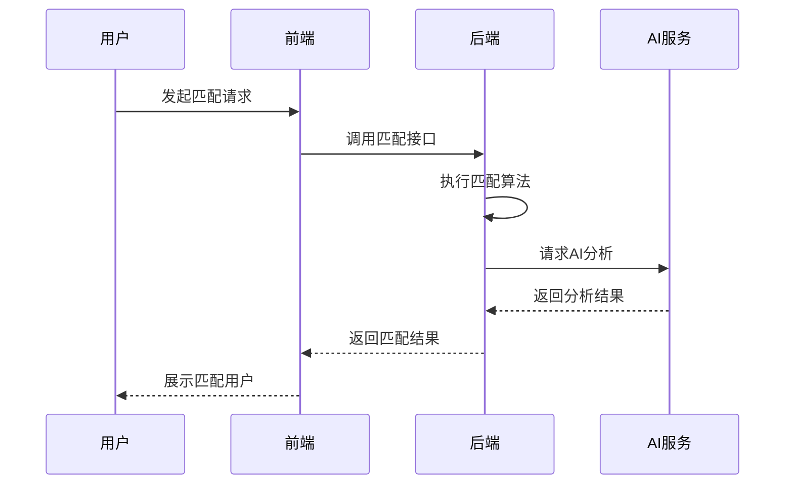

# 智能相亲平台 (AI Dating Platform)

## 项目简介

智能相亲平台是一个基于AI技术的现代化婚恋交友平台，致力于为用户提供精准的匹配服务。平台结合了传统的婚恋交友功能和先进的人工智能技术，通过多维度的用户画像分析和智能匹配算法，帮助用户找到最适合的伴侣。

## 项目截图

### 用户注册/登录

*用户注册界面*


*用户登录界面*

### 个人中心



*用户个人信息管理和匹配状态展示*


### 智能匹配

*匹配结果展示页面*

> 注：请将实际的截图文件放在 `docs/images/` 目录下，并确保图片名称与上述一致。建议图片尺寸保持一致，推荐分辨率为1920x1080或1280x720。

## 项目特点

- 🤖 AI颜值评分：通过先进的计算机视觉技术，对用户照片进行专业的颜值分析
- 💝 智能匹配：基于多维度数据的匹配算法，确保匹配的精准性
- 🎯 价值观匹配：注重用户三观的匹配度，提高匹配质量
- ✨ 真实可靠：严格的实名认证机制，确保用户真实性

## 技术架构

### 开发环境
- 操作系统：Windows 10/11、MacOS、Linux
- 开发工具：
  - IntelliJ IDEA 2023.1+
  - Visual Studio Code 1.80+
  - Git 2.40+
- 构建工具：
  - Maven 3.6+
  - Node.js 16.0+
  - npm 8.0+

### 运行环境
- JDK：1.8+
- MySQL：8.0+
- Nginx：1.20+
- Redis：6.2+（计划中）

### 前端技术栈
- 核心框架：
  - Vue 3.3+
  - TypeScript 5.0+
  - Vite 4.0+
- UI框架：
  - Element Plus 2.3+
  - Sass/SCSS
- 状态管理：
  - Pinia 2.1+
- 路由管理：
  - Vue Router 4.2+
- HTTP客户端：
  - Axios 1.4+
- 工具库：
  - dayjs（时间处理）
  - lodash（工具函数）
  - echarts（图表展示）

### 后端技术栈
- 核心框架：
  - Spring Boot 2.3.0.RELEASE
  - Spring MVC
  - Spring Security（计划中）
- ORM框架：
  - MyBatis Plus 3.0.7.1
  - MyBatis
- 数据库：
  - MySQL 8.0.25
  - Redis（计划中）
- 对象存储：
  - 阿里云OSS SDK 3.17.4
- AI服务：
  - DashScope API
- 工具库：
  - Lombok 1.18.20
  - commons-io 2.11.0
  - slf4j 1.7.36

### 开发规范
- 前端编码规范：
  - ESLint
  - Prettier
  - TypeScript strict mode
- 后端编码规范：
  - 阿里巴巴Java开发手册
  - Google Java Style Guide
- 版本控制：
  - Git
  - Git Flow 工作流
- 项目构建：
  - Maven 多模块构建
  - npm 模块化开发

### 项目结构
```
dating-platform
├── docs                           # 项目文档
│   └── images                     # 项目截图和相关图片
├── frontend                       # 前端项目目录
│   ├── public                     # 静态资源
│   │   └── images          # 图片资源
│   ├── src                       # 源代码
│   │   ├── assets               # 资源文件
│   │   │   └── styles          # 样式文件
│   │   ├── components          # 公共组件
│   │   ├── router              # 路由配置
│   │   ├── store               # 状态管理
│   │   ├── utils               # 工具函数
│   │   └── views               # 页面组件
│   ├── package.json             # 依赖配置
│   └── vite.config.ts           # Vite配置
├── src                           # 后端项目目录
│   └── main
│       ├── java/com/dating/platform
│       │   ├── config           # 配置类
│       │   ├── controller       # 控制器
│       │   ├── dto             # 数据传输对象
│       │   ├── entity          # 实体类
│       │   ├── mapper          # MyBatis映射器
│       │   ├── service         # 服务层
│       │   │   └── impl       # 服务实现
│       │   └── utils           # 工具类
│       └── resources
│           ├── mapper          # MyBatis XML映射文件
│           ├── static          # 静态资源
│           └── application.yml # 应用配置文件
├── pom.xml                       # Maven配置
└── README.md                     # 项目说明文档
```

### 系统架构图



## 核心功能流程

### 用户注册登录流程



### 智能匹配流程



## 主要功能模块

### 1. 用户管理
- 用户注册
- 用户登录
- 个人信息管理
- 头像上传

### 2. AI颜值评分
- 照片上传与分析
- 颜值评分（0-100分）
- 五官、轮廓、肤质、气质多维度分析
- 个性化改进建议

### 3. 智能匹配系统
- 基础信息匹配（年龄、身高、地域等）
- MBTI性格匹配
- 核心价值观匹配
- 生活方式匹配
- 沟通方式匹配
- 现实条件匹配

### 4. 匹配权重分配
- 现实条件：25%
- 颜值匹配：20%
- 价值观匹配：20%
- 基础信息：15%
- 沟通方式：10%
- 生活方式：10%

## 待改进方向

### 1. 技术架构改进
- [ ] 引入微服务架构，提高系统可扩展性
- [ ] 添加Redis缓存层，提升系统性能
- [ ] 引入消息队列，优化异步处理
- [ ] 完善日志系统，添加ELK日志分析
- [ ] 增加系统监控和告警机制

### 2. 功能完善
- [ ] 添加即时通讯功能
- [ ] 增加用户认证体系
- [ ] 完善用户隐私保护机制
- [ ] 添加活动组织功能
- [ ] 增加用户反馈系统

### 3. 算法优化
- [ ] 优化匹配算法，提高匹配准确度
- [ ] 引入机器学习模型，实现智能推荐
- [ ] 完善MBTI匹配规则
- [ ] 添加更多维度的用户画像分析
- [ ] 优化颜值评分算法

### 4. 用户体验提升
- [ ] 优化移动端适配
- [ ] 提升页面加载速度
- [ ] 完善用户引导流程
- [ ] 优化匹配展示效果
- [ ] 增加用户互动功能

## 安装部署

### 环境要求
- JDK 1.8+
- Node.js 14+
- MySQL 8.0+
- Maven 3.6+
- Nginx 1.20+

### 后端部署
```bash
# 克隆项目
git clone [项目地址]

# 进入项目目录
cd dating-platform

# 编译打包
mvn clean package

# 运行项目
java -jar target/dating-platform-1.0.0.jar
```

### 前端部署
```bash
# 进入前端目录
cd frontend

# 安装依赖
npm install

# 开发环境运行
npm run dev

# 生产环境打包
npm run build
```

### Nginx配置
将打包后的前端文件部署到Nginx，需要进行如下配置：

```nginx
server {
    listen       81;

    location / {
        root   /usr/share/nginx/html;  # 前端文件存放目录
        index  index.html;
        try_files $uri $uri/ /index.html;  # 处理 Vue 路由
    }

    # 配置后端接口代理
    location /api {
        proxy_pass http://47.120.78.125:8080;  # 后端服务地址
        proxy_set_header Host $host;
        proxy_set_header X-Real-IP $remote_addr;
        proxy_set_header X-Forwarded-For $proxy_add_x_forwarded_for;

        # 添加跨域相关配置
        add_header Access-Control-Allow-Origin *;
        add_header Access-Control-Allow-Methods 'GET, POST, OPTIONS';
        add_header Access-Control-Allow-Headers 'DNT,X-Mx-ReqToken,Keep-Alive,User-Agent,X-Requested-With,If-Modified-Since,Cache-Control,Content-Type,Authorization';

        # 处理 OPTIONS 请求
        if ($request_method = 'OPTIONS') {
            return 204;
        }
    }

    # 添加错误页面配置
    error_page   500 502 503 504  /50x.html;
    location = /50x.html {
        root   /usr/share/nginx/html;
    }
}
```

配置说明：
1. 将打包后的前端文件复制到 `/usr/share/nginx/html` 目录
2. Nginx监听81端口
3. 配置了Vue路由的history模式支持
4. 设置了后端接口代理，避免跨域问题
5. 添加了必要的跨域配置
6. 配置了错误页面处理

部署步骤：
1. 将前端打包后的文件复制到Nginx目录：
```bash
# 复制打包文件到Nginx目录
cp -r dist/* /usr/share/nginx/html/

# 重启Nginx服务
systemctl restart nginx
```

2. 检查服务是否正常运行：
```bash
# 检查Nginx状态
systemctl status nginx

# 检查端口是否正常监听
netstat -tunlp | grep 81
```

## 配置说明

### 数据库配置
```yaml
spring:
  datasource:
    url: jdbc:mysql://localhost:3306/dating_platform
    username: your_username
    password: your_password
```

### OSS配置
```yaml
aliyun:
  oss:
    endpoint: your_endpoint
    accessKeyId: your_access_key_id
    accessKeySecret: your_access_key_secret
    bucketName: your_bucket_name
```

### AI服务配置
```yaml
dashscope:
  api:
    key: your_api_key
```

## 贡献指南

1. Fork 本仓库
2. 创建新的分支 `git checkout -b feature/your-feature`
3. 提交你的修改 `git commit -m 'Add some feature'`
4. 推送到分支 `git push origin feature/your-feature`
5. 提交 Pull Request

## 联系作者

如果您对这个项目感兴趣，或者有任何问题和建议，欢迎通过以下方式联系作者：

### 添加作者微信

*扫码添加作者微信，备注：智能相亲*

### 赞赏支持
如果这个项目对您有帮助，欢迎请作者喝杯咖啡 ☕


*扫码支持作者继续创作*

## 版权说明

本项目采用 MIT 许可证，详情请参见 [LICENSE](LICENSE) 文件。

---
*感谢您的关注和支持！* ❤️
